# ICE Entertainment — Data Warehouse
 
A full-stack enterprise data warehouse solution for **ICE Entertainment**, a global digital entertainment retailer operating 500 stores across 10 countries. Built using **MySQL**, **Pentaho Data Integration**, and dimensional modelling best practices.
 
> *"The objective is to provide a global truth — a single source of data for all managerial reports."*
> — Dhil Rodnut, CEO, ICE Entertainment
 
---
 
## The Problem
 
ICE Entertainment had data scattered across two disconnected systems:
 
- **Sales System (Informix)** — knew what was sold, to whom, when and where
- **ERP System (Oracle)** — knew what products cost and what was in stock
 
Neither system could answer the question that mattered most to the board:
 
> **How profitable are we — by product, by customer, and by market?**
 
---
 
## The Solution
 
A unified **star schema data warehouse** that integrates both source systems into a single trusted source of truth — enabling management to analyse revenue, cost, and margin across customers, products, stores, and time.
 
---
 
## Tech Stack
 
| Tool | Purpose |
|---|---|
| MySQL 8.0 | Data warehouse database |
| MySQL Workbench | Schema design and ER diagrams |
| Pentaho Data Integration | ETL pipeline development |
| SQL | Analytical queries and business intelligence |
| Git & GitHub | Version control and team collaboration |
 
---
 
## Data Warehouse Architecture
 
### Five Layer Architecture
 

 
### Star Schema
 
One central fact table surrounded by six dimension tables:
 
```
                  dim_date
                      ↑
dim_customer  ←  fact_sales  →  dim_product
                      ↓
                  dim_store
 
         + dim_currency + dim_subscription
```
 
| Table | Description |
|---|---|
| `fact_sales` | One row per order line item — stores qty, revenue, cost and margin in USD |
| `dim_date` | Calendar and fiscal date attributes — ICE fiscal year runs Sep to Aug |
| `dim_customer` | Customer demographics, location and market segment with SCD Type 2 history |
| `dim_product` | Product catalogue with 3-level hierarchy: Category → Type → Product |
| `dim_store` | Store locations with 6-level geographic hierarchy |
| `dim_currency` | Monthly exchange rates for multi-currency to USD conversion |
| `dim_subscription` | Customer subscription packages and pricing |
 
### Key Metrics
 
```
Dollar Sales (USD)  =  qty × price × exchange_rate
Cost (USD)          =  qty × unit_cost × exchange_rate
Margin (USD)        =  Dollar Sales (USD) − Cost (USD)
```
 
---
 
## Business Intelligence Queries
 
The warehouse answers 5 key management questions:
 
| # | Business Question | Dimensions Used |
|---|---|---|
| 1 | Who are the most valuable customers? | dim_customer, dim_date |
| 2 | Which products are the most profitable? | dim_product, dim_date |
| 3 | Which store locations are the most profitable? | dim_store, dim_date |
| 4 | Which time periods generate the most revenue? | dim_date |
| 5 | Which market segment is the most profitable? | dim_store, dim_date |
 
---
 
## Repository Structure
 
```
ICE-Entertainment-Data-Warehouse/
│
├── README.md
├── .gitignore
│
├── dataset/                          # Source data files (read-only)
│   ├── Customer.xlsx
│   ├── Order_Header.xlsx
│   ├── Order_Details.xlsx
│   ├── Product.xlsx
│   ├── Store.xlsx
│   ├── Subscription.xlsx
│   ├── Currency_Rate.xlsx
│   └── ... (all reference tables)
│
├── SQL Scripts/
│   ├── 01_create_database.sql        # Warehouse database
│   ├── 02_dim_date.sql               # Date dimension (provided)
│   ├── 03_dim_customer.sql           # Customer dimension (SCD Type 2)
│   ├── 04_dim_product.sql            # Product dimension
│   ├── 05_dim_store.sql              # Store dimension
│   ├── 06_dim_currency.sql           # Currency dimension
│   ├── 07_dim_subscription.sql       # Subscription dimension
│   ├── 08_fact_sales.sql             # Central fact table
│   ├── 09_staging_database.sql       # Staging Database + 13 tables
│   └── 10_analytical_queries.sql     # Management insight queries
│
├── Pentaho/                          # ETL transformation files
│   ├── Stage_ETL.ktr                 # Load all xlsx → stg tables
│   ├── load_dim_product.ktr
│   ├── load_dim_store.ktr
│   ├── load_dim_customer.ktr
│   ├── load_dim_currency.ktr
│   ├── load_dim_subscription.ktr
│   ├── load_fact_sales.ktr
│   └── master_job.kjb
│
├── Reports/                          # Screenshots and documentation
│   ├── screenshots/
|   └── Star Schema Design.pdf
│
└── Docs/
    ├── data_dictionary.md
    ├── Assessment 1 Case Study_T1 2026.pdf
    └── MIS774 Assessment 1 Requirements.pdf

```
 
---
 
## Complete Setup Guide
 
Follow these steps **in order** to recreate the entire data warehouse on your local machine.
 
---
 
### Prerequisites
 
Install these tools before starting:
 
- **MySQL 8.0+** — download from mysql.com
- **MySQL Workbench** — download from mysql.com/products/workbench
- **Pentaho Data Integration 11** — download Community Edition from Hitachi Vantara
- **MySQL Connector/J** — download from mysql.com/products/connector (needed for Pentaho)
- **Git** — download from git-scm.com
 
---
 
### Step 1 — Clone the Repository
 
```bash
git clone https://github.com/Sky-Nik/ICE-Entertainment-Data-Warehouse.git
cd ICE-Entertainment-Data-Warehouse
```
 
---
 
### Step 2 — Set Up MySQL
 
Open MySQL Workbench and increase the timeout before running any scripts:
 
```
Edit → Preferences → SQL Editor
Set "DBMS connection read timeout" to 600
Close and reconnect to MySQL
```
 
Then run these commands:
 
```sql
SET GLOBAL connect_timeout = 600;
SET GLOBAL wait_timeout = 600;
SET GLOBAL interactive_timeout = 600;
```
 
---
 
### Step 3 — Clean Up Existing Databases (if needed)
 
If you have old databases from previous work, clean them up first:
 
```sql
-- Check what databases exist
SHOW DATABASES;
 
-- Drop only the ones you created (NEVER drop system databases)
-- Safe to drop:
SET FOREIGN_KEY_CHECKS = 0;
DROP DATABASE IF EXISTS dw;
DROP DATABASE IF EXISTS stg;
SET FOREIGN_KEY_CHECKS = 1;
 
-- NEVER drop these system databases:
-- information_schema, mysql, performance_schema, sys
```
 
---
 
### Step 4 — Create the Staging Database
 
The staging database is a **raw copy** of all source files — no joins, no transformations, no primary keys.
 
Run `SQL Scripts/09_staging_database.sql` in MySQL Workbench.
 
This creates the `stg` database with 13 tables:
 
```sql
USE stg;
SHOW TABLES;
```
 
Expected output:
```
stg_currency
stg_currency_rate
stg_customer
stg_division
stg_house_hold_income
stg_order_details
stg_order_header
stg_package
stg_product
stg_product_type
stg_region
stg_store
stg_subscription
```
 
> **Why staging?** Staging is a temporary holding area that mirrors the source data exactly. It separates the "extract" step from the "transform" step, making the pipeline easier to debug and audit.
 
---
 
### Step 5 — Create the Data Warehouse Database
 
Run these scripts **in order** — dimension tables must exist before the fact table:
 
```
SQL Scripts/01_create_database.sql   → creates dw database
SQL Scripts/02_dim_date.sql          → 10,592 rows (1998 to 2026) ⚠️ takes 1-2 mins
SQL Scripts/03_dim_customer.sql      → customer dimension
SQL Scripts/04_dim_product.sql       → product dimension
SQL Scripts/05_dim_store.sql         → store dimension
SQL Scripts/06_dim_currency.sql      → currency dimension
SQL Scripts/07_dim_subscription.sql  → subscription dimension
SQL Scripts/08_fact_sales.sql        → fact table (run LAST)
```
 
> ⚠️ **Important:** `02_dim_date.sql` takes 1-2 minutes to run — it inserts 10,592 rows one by one. This is normal. Do not cancel it.
 
Verify all tables were created:
 
```sql
USE dw;
SHOW TABLES;
```
 
Expected output:
```
dim_currency
dim_customer
dim_date
dim_product
dim_store
dim_subscription
fact_sales
```
 
---
 
### Step 6 — Connect Pentaho to MySQL
 
Before building any transformations, add the MySQL driver to Pentaho:
 
```
1. Download mysql-connector-j-8.x.x.jar from mysql.com
2. Copy the .jar file to:
   Windows: C:\Program Files\Pentaho\data-integration\lib\
   Mac:     /Applications/data-integration/lib/
3. Restart Pentaho completely
```
 
Then create a database connection in Pentaho:
 
```
1. Open Pentaho Spoon
2. Click View → Connections → New
3. Fill in:
   Connection Name: ICE_Entertainment
   Connection Type: MySQL
   Host:            localhost
   Database:        stg
   Port:            3306
   Username:        root
   Password:        your MySQL password
4. Click "Test Connection" → should show "Connection successful!"
5. Click OK
```
 
---
 
### Step 7 — Load Staging (Phase 1 ETL)
 
Open `Pentaho/Stage_ETL.ktr` in Pentaho Spoon.
 
This transformation loads all Excel source files directly into the staging tables. Each pipeline follows the same simple pattern:
 
```
[Excel Input] → [Table Output]
```
 
The canvas has 13 pipelines running in parallel:
 
```
Order_Details.xlsx     →  stg_order_details
Order_Header.xlsx      →  stg_order_header
Customer.xlsx          →  stg_customer
Store.xlsx             →  stg_store
Product.xlsx           →  stg_product
Product_Type.xlsx      →  stg_product_type
Subscription.xlsx      →  stg_subscription
Package.xlsx           →  stg_package
Region.xlsx            →  stg_region
Division.xlsx          →  stg_division
House_Hold_Income.xlsx →  stg_house_hold_income
Currency_Rate.xlsx     →  stg_currency_rate
Currency.xlsx          →  stg_currency
```
 
Press **F9** to run. Verify row counts after loading:
 
```sql
USE stg;
SELECT 'stg_order_details'    AS table_name, COUNT(*) AS rows FROM stg_order_details    UNION ALL
SELECT 'stg_order_header'     AS table_name, COUNT(*) AS rows FROM stg_order_header     UNION ALL
SELECT 'stg_customer'         AS table_name, COUNT(*) AS rows FROM stg_customer         UNION ALL
SELECT 'stg_store'            AS table_name, COUNT(*) AS rows FROM stg_store            UNION ALL
SELECT 'stg_product'          AS table_name, COUNT(*) AS rows FROM stg_product          UNION ALL
SELECT 'stg_product_type'     AS table_name, COUNT(*) AS rows FROM stg_product_type     UNION ALL
SELECT 'stg_subscription'     AS table_name, COUNT(*) AS rows FROM stg_subscription     UNION ALL
SELECT 'stg_package'          AS table_name, COUNT(*) AS rows FROM stg_package          UNION ALL
SELECT 'stg_currency_rate'    AS table_name, COUNT(*) AS rows FROM stg_currency_rate    UNION ALL
SELECT 'stg_currency'         AS table_name, COUNT(*) AS rows FROM stg_currency;
```
 
Expected row counts:
```
stg_order_details    50,000
stg_order_header     17,000
stg_customer          5,000
stg_store               500
stg_product           1,000
stg_product_type         65
stg_subscription      3,000
stg_package              24
stg_currency_rate       357
stg_currency            175
```
 
---
 
### Step 8 — Load Warehouse (Phase 2 ETL)
 
Once staging is loaded, run the warehouse transformations in this order:
 
```
1. load_dim_product.ktr      → joins stg_product + stg_product_type
2. load_dim_store.ktr        → joins stg_store + stg_region + stg_division
3. load_dim_currency.ktr     → loads stg_currency_rate
4. load_dim_subscription.ktr → joins stg_subscription + stg_package
5. load_dim_customer.ktr     → loads stg_customer (SCD Type 2)
6. load_fact_sales.ktr       → joins all staging tables (run LAST)
```
 
> ⚠️ **Important:** Always load dimension tables before `fact_sales`. The fact table has foreign keys pointing to all dimensions — they must exist first.
 
Verify warehouse row counts:
 
```sql
USE dw;
SELECT 'dim_date'         AS table_name, COUNT(*) AS rows FROM dim_date         UNION ALL
SELECT 'dim_customer'     AS table_name, COUNT(*) AS rows FROM dim_customer     UNION ALL
SELECT 'dim_product'      AS table_name, COUNT(*) AS rows FROM dim_product      UNION ALL
SELECT 'dim_store'        AS table_name, COUNT(*) AS rows FROM dim_store        UNION ALL
SELECT 'dim_currency'     AS table_name, COUNT(*) AS rows FROM dim_currency     UNION ALL
SELECT 'dim_subscription' AS table_name, COUNT(*) AS rows FROM dim_subscription UNION ALL
SELECT 'fact_sales'       AS table_name, COUNT(*) AS rows FROM fact_sales;
```
 
---
 
### Step 9 — Verify the Star Schema
 
Open MySQL Workbench and generate the ER diagram:
 
```
Database → Reverse Engineer → Select dw → Finish
```
 
You should see all 7 tables connected with relationship lines. Take a screenshot — this goes into the report!
 
---
 
## Key Design Decisions
 
**SCD Type 2 on dim_customer**
Customer addresses change over time. The warehouse records the location at the time of each sale using effective/expiry dates and an `is_current` flag.
 
**Fiscal Calendar**
ICE Entertainment operates on a September to August fiscal year. The date dimension includes fiscal year, fiscal quarter and fiscal period alongside standard calendar attributes.
 
**Multi-Currency Conversion**
All transactions are converted to USD using monthly exchange rates. All margin reporting is in USD.
 
**No Primary Keys in Staging**
Staging tables have no primary keys or constraints intentionally — this speeds up loading and allows duplicate detection before warehouse load.
 
**Market Segmentation**
Markets (Victoria, Rest of Australia, International) are stored as attributes in dim_customer and dim_store rather than a separate table — they only have 3 values and are already present in the source data.
 
---
 
## Branch Strategy
 
```
main          ← stable, production-ready
└── dev       ← integration branch
    ├── feature/sql-schema
    ├── feature/etl-pentaho
    ├── feature/sql-queries
    └── feature/report-writeup
```
 
---
 
## Contributors
 
| Name | Role |
|---|---|
| Nikhil Gupta | Data Warehouse Architect & SQL Developer |
| TBD | ETL Developer |
| TBD | BI & Analytics |
| TBD | Documentation |
 
